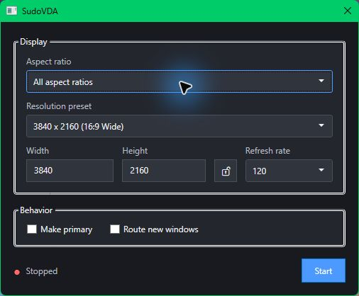

# SudoVDA GUI

A small Windows GUI for creating and managing a temporary virtual display with SudoVDA.

> [!IMPORTANT]
> This project is a proof of concept. It currently requires Apollo to be installed because Apollo provides the SudoVDA driver. A future version should remove this dependency.



## Features

- Create one temporary virtual display.
- Choose its aspect ratio, resolution, and refresh rate.
- Match the current primary display.
- Lock the aspect ratio while entering a custom resolution.
- Optionally make the virtual display primary.
- Optionally move newly opened windows onto it.
- Remove the display and restore the previous layout when stopped.

## Requirements

- Windows 10 or Windows 11, x64
- Apollo with its SudoVDA driver installed
- .NET 10 Desktop Runtime

## Usage

1. Run `SudoVDA-GUI.exe`.
2. Choose a resolution preset, or enter a custom width and height.
3. Select the refresh rate.
4. Enable **Make primary** or **Route new windows** if wanted.
5. Select **Start** to create the virtual display.
6. Select **Stop** when finished.

Closing the app also removes its virtual display and restores the previous display layout.

## Limitations

- This is a proof of concept, not a finished product.
- Only one virtual display is supported.
- Only windows opened after routing starts are moved.
- Elevated, protected, and system windows may not move.
- Force-closing the process can leave the virtual display active until SudoVDA cleans it up.

## Building from source

Install the .NET 10 SDK, then run:

```powershell
dotnet build src\SudoVDA.GUI\SudoVDA.GUI.csproj -c Release
```

The executable is written to:

```text
src\SudoVDA.GUI\bin\Release\net10.0-windows\SudoVDA-GUI.exe
```
